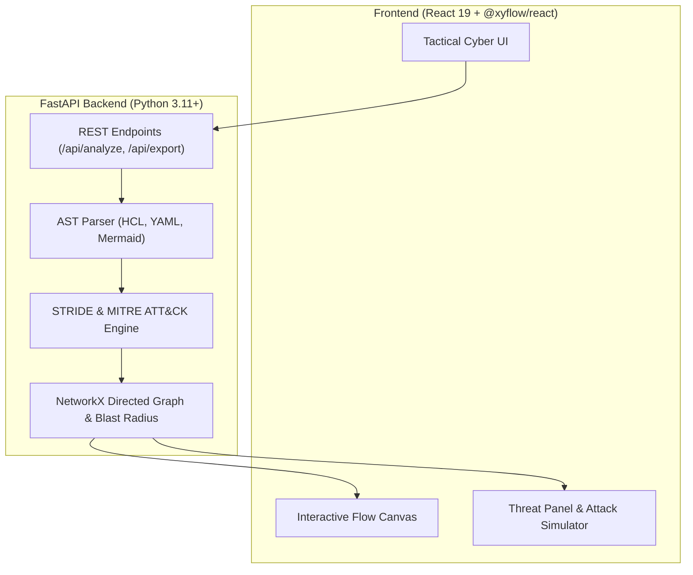

# 🛡️ ThreatForge AI
> **Automated STRIDE & MITRE Threat Modeling Engine for Cloud Architects & SecOps**

[](https://fastapi.tiangolo.com)
[](https://react.dev)
[](https://reactflow.dev)
[](https://python.org)
[](https://tailwindcss.com)
[](LICENSE)

ThreatForge AI — dasturiy ta'minot va bulut arxitektorlari hamda kiberxavfsizlik (SecOps/AppSec) muhandislari uchun yaratilgan avtonom platforma. Tizim arxitekturasi kodini (**Terraform HCL**, **Docker Compose YAML**, **Mermaid.js diagrammalari**) daqiqalar ichida skanerlab, **STRIDE** va **MITRE ATT&CK** tahdidlarini aniqlaydi, qizil jamoa (Red Team) hujum yo'llarini jonli simulyatsiya qiladi va to'g'irlangan kod patchlarini (`git diff`) taqdim etadi.

---

## 🌟 Asosiy Imkoniyatlar (Core Features)

1. **Multi-Format Architecture Ingestion:**
   - **Terraform HCL (`.tf`):** AWS Security Groups, S3 chelaklari, RDS bazalari, ALB, IAM qoidalari.
   - **Docker Compose (`.yml`):** Ochiq portlar (0.0.0.0/0), xizmatlar bog'liqligi (`depends_on`), shifrlanmagan o'zgaruvchilar.
   - **Mermaid Flowcharts (`.mmd`):** `flowchart TD` yoki `graph LR` orqali kiritilgan vizual diagrammalar.

2. **Avtomatlashtirilgan STRIDE Tahlili:**
   - **S**poofing (Autentifikatsiyasiz xizmatlar, ochiq mikroservislar).
   - **T**ampering (Chegaralararo shifrlanmagan aloqa, ochiq HTTP).
   - **R**epudiation (Ma'lumotlar bazasida audit loglarining yo'qligi).
   - **I**nformation Disclosure (Ochiq internetga qarayotgan Postgres/MySQL/Redis, public S3 chelaklar).
   - **D**enial of Service (Ingress darajasida WAF va Rate-Limiting yo'qligi).
   - **E**levation of Privilege (Redis RCE xavfi, hardcode qilingan parollar).

3. **Autonomous Red Team Attack Path Simulator:**
   - Tashqi dunyodan (Public Internet) eng nozik serverlargacha (Database, Redis, Storage) olib boruvchi hujum zanjirini interaktiv canvasda qizil pulsatsiyali chiziqlar orqali jonli ko'rsatadi.

4. **1-Click Security Remediation (Avtomatik tuzatishlar):**
   - Har bir aniqlangan zaiflik uchun tayyor `git diff` / Terraform / Compose patchlarini nusxalash imkoniyati.

5. **CISO & Executive Threat Model Report:**
   - Auditdan o'tish uchun barcha topologik tugunlar, CVSS 4.0 skori, MITRE ATT&CK identifikatorlari va bartaraf etish rejasini o'z ichiga olgan Markdown hisobotini 1-klikda yuklab olish.

---

## 🏗️ Tizim Arxitekturasi



---

## 🚀 Ishga Tushirish (Quick Start)

### 1-usul: Windows 1-Klikli Skript (Tavsiya etiladi)
Loyihaning ildiz papkasida PowerShell orqali ishga tushiring:
```powershell
.\run.ps1
```
Bu skript avtomatik ravishda portlarni tozalaydi, backend va frontendni ko'taradi hamda brauzerda `http://localhost:5173` manzilini ochadi.

---

### 2-usul: Docker Compose orqali
```bash
docker-compose up --build
```
- **Frontend:** http://localhost:5173
- **Backend API:** http://localhost:8000
- **Swagger Docs:** http://localhost:8000/docs

---

### 3-usul: Qo'lda (Manual)

#### Backend:
```bash
cd backend
uv venv .venv
.\.venv\Scripts\activate
uv pip install -r requirements.txt
uvicorn app.main:app --reload --port 8000
```

#### Frontend:
```bash
cd frontend
npm install
npm run dev
```

---

## 🧪 Avtomatlashtirilgan Testlar

Backend testlarini ishga tushirish:
```bash
cd backend
.\.venv\Scripts\python -m pytest tests -v
```

---

## 📄 Litsenziya
MIT License © 2026 ThreatForge AI. Javohirbek Asqarov (Jasper).
